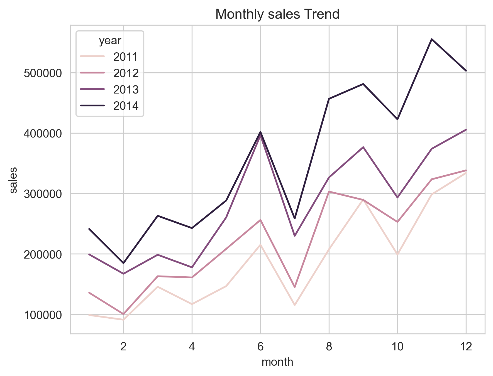
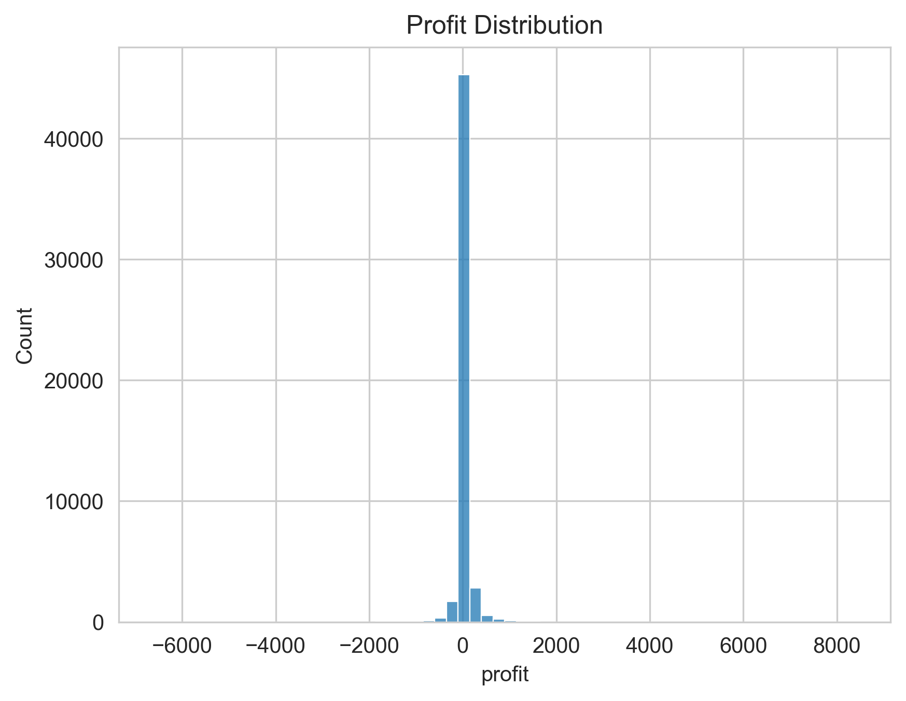
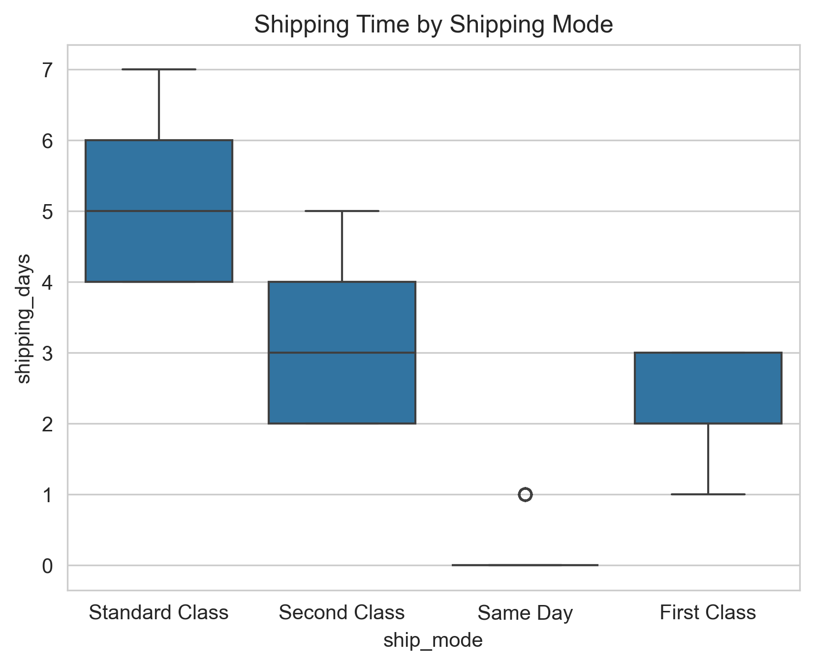
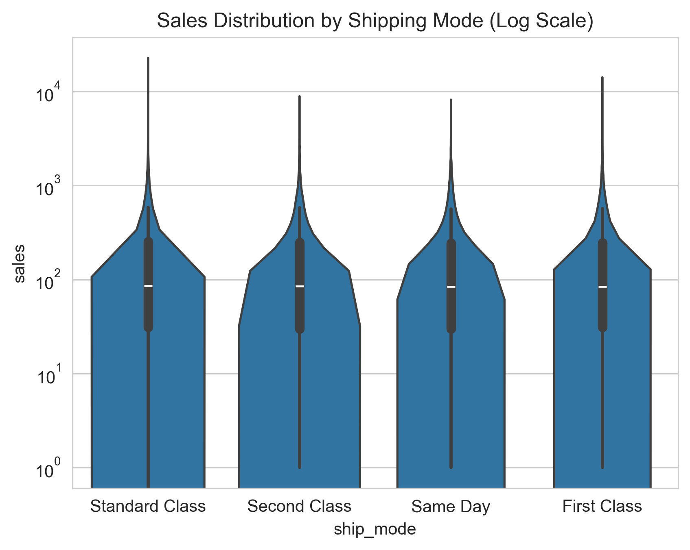
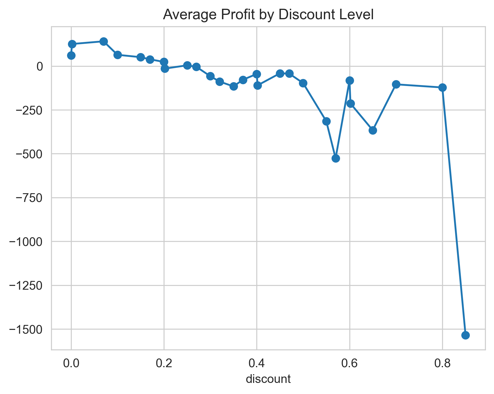
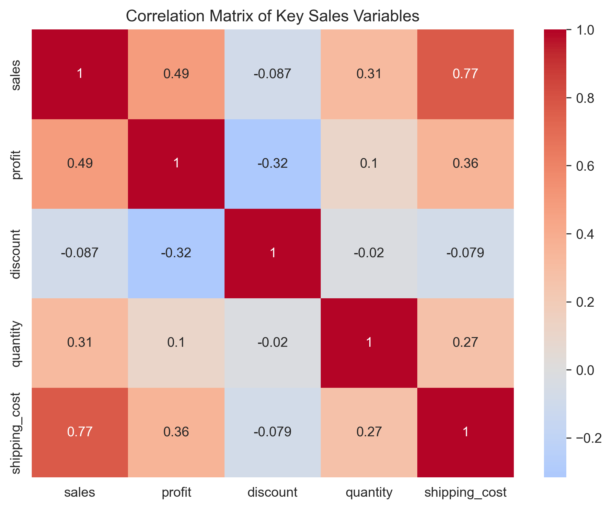
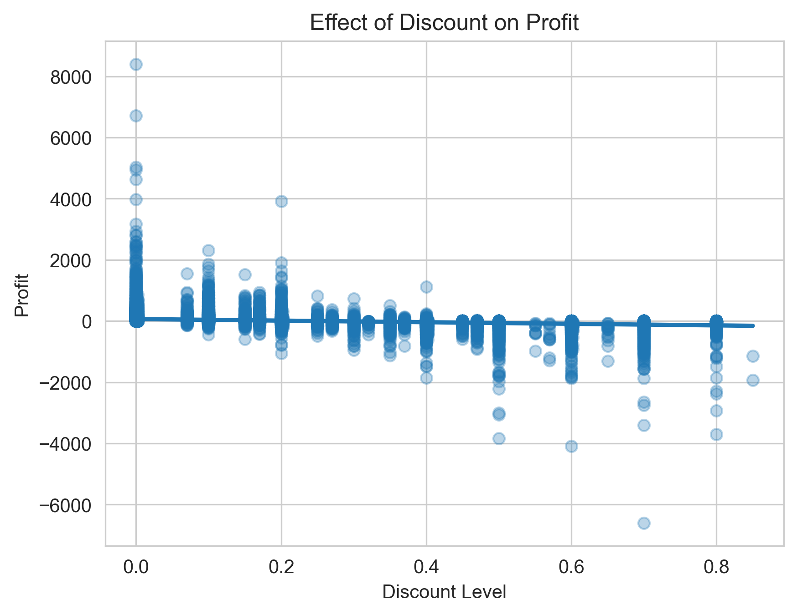
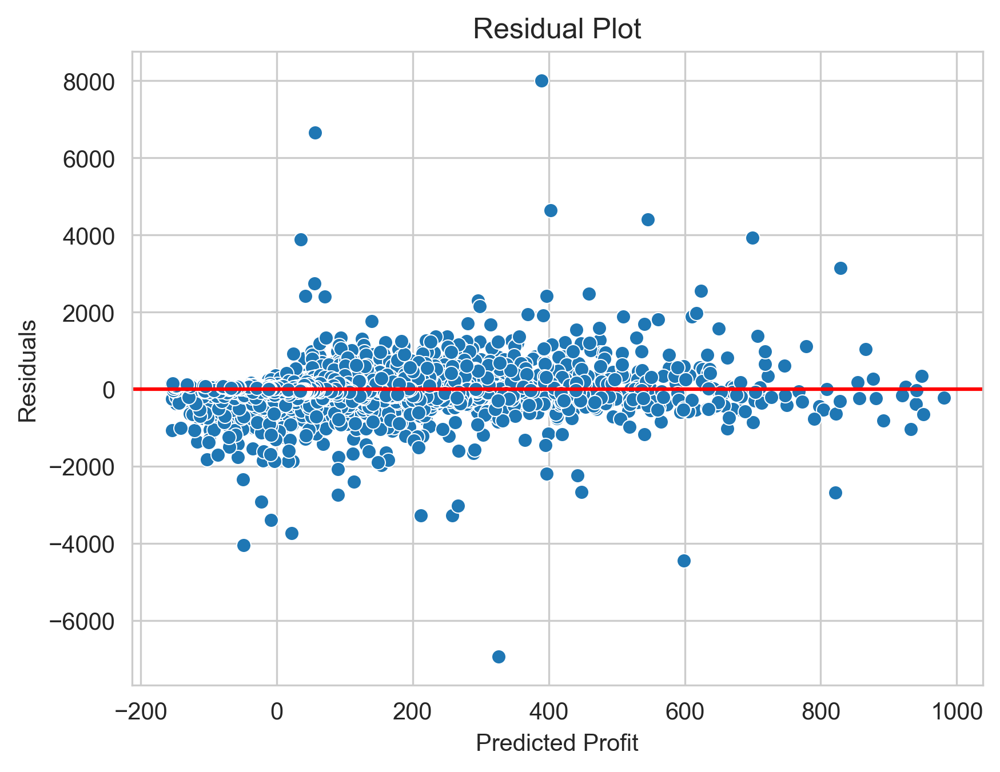

# Superstore Sales & Profitability Analysis

## Project Overview

This project explores a retail sales dataset to identify **operational and commercial patterns associated with sales performance and profitability**. The analysis focuses on understanding which transaction characteristics are most strongly related to revenue generation and profit outcomes through structured **exploratory data analysis (EDA)** and **regression modelling**.

The goal of the project is to demonstrate a practical workflow for:

- Data cleaning  
- Exploratory data analysis  
- Feature investigation  
- Profitability analysis  
- Operational performance investigation  
- Analytical interpretation  

The project was completed using **Python** and **Jupyter Notebook**.

---

# Example Analysis

Below are example visualisations from the exploratory analysis.

## Monthly Sales Trend

## Profit Distribution

## Shipping Time by Mode

## Sales Distribution by Shipping Mode

## Profit by Discount Level

## Correlation Heatmap

## Discount vs Profit Regression

## Regression Residual Plot

---

# Dataset

The dataset contains **51,290 retail transactions** with variables describing order behaviour, product characteristics, and financial performance.

Example features include:

- Order date  
- Ship date  
- Shipping mode  
- Product category and sub-category  
- Sales revenue  
- Quantity sold  
- Discount  
- Profit  
- Shipping cost  
- Region and market  

The primary variables of interest include:

`Sales`, `Profit`, `Discount`, and `Ship_Mode`

which support the investigation of commercial and operational performance.

---

# Methodology

The analysis follows a structured exploratory data analysis workflow:

1. Data Overview  
2. Data Quality Assessment  
3. Data Cleaning  
4. Feature Engineering  
5. Exploratory Data Analysis  
6. Operational Performance Investigation  
7. Profitability Analysis  
8. Correlation Analysis  
9. Multiple Linear Regression  
10. Summary of Key Findings  

The objective is to identify **commercial and operational factors that may influence sales and profit performance**.

---

# Key Findings

### Discount impact on profit

Discount levels show a **clear negative relationship with profit**. Higher discount rates frequently lead to lower profits and in some cases loss-making transactions.

This suggests that **aggressive discounting can significantly erode profit margins**.

---

### Category profitability

Technology and Office Supplies generate **stronger average profit performance** compared to Furniture, indicating meaningful differences in category margin structure.

This suggests that **product mix is an important driver of profitability**.

---

### Shipping behaviour

Standard Class accounts for the **largest share of transactions** and exhibits longer delivery times than other transport modes. However, shipping mode appears to have limited influence on order value.

---

### Sales and shipping cost relationship

Sales and shipping cost demonstrate a **strong positive correlation**, suggesting that larger orders tend to incur higher shipping costs.

---

### Regression analysis

Multiple linear regression indicates that **discount has the strongest negative influence on profit**, while variables such as quantity and shipping cost show smaller positive relationships.

---

### Overall conclusion

The analysis suggests that profitability in this dataset is more strongly associated with **discount strategy, product category, and order value** rather than shipping mode alone.

Variables such as **discount and category structure** appear to provide more meaningful commercial signals when evaluating profit performance.

---

# Tools & Libraries

The analysis was conducted using Python and the following libraries:

- Pandas  
- NumPy  
- Matplotlib  
- Seaborn  
- Scikit-learn  
- Jupyter Notebook  

---

# Project Skills Demonstrated

This project demonstrates practical analytical skills including:

- Data cleaning and preparation  
- Exploratory data analysis (EDA)  
- Feature engineering  
- Operational analysis  
- Profitability analysis  
- Correlation analysis  
- Regression modelling  
- Data visualisation  
- Analytical interpretation and reporting

# Repository Structure
superstore-sales-analysis
│
├── superstore_sales.ipynb
├── SuperStoreOrders.csv
│
├── charts
│ ├── month_sales.png
│ ├── profit_distribution.png
│ ├── shipping_time_by_mode.png
│ ├── sales_distribution_shipping_mode_log.png
│ ├── average_profit_by_discount.png
│ ├── correlation_matrix_sales_variables.png
│ ├── discount_profit_regression.png
│ └── residual_plot.png
│
└── README.md

Author

Joshua Garthwaite
